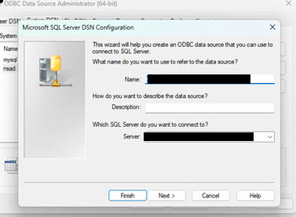

# HCM2 Student Datasheet process.  Excel load to staging database table

## Description
`hcm2.py` is a Python script designed to load data from the Dept of Education's HCM2 Student Datasheet Excel files into a staging database. 
It supports both SQL Server and MySQL through ODBC connections.  It will require creating an ODBC 
DSN on the server.

## Features
- Uploads excel data to a staging database table.  You will have to configure to 
the data and table structure
 
## Requirements
- Python 3.x
- `openpyxl`
- `pyodbc`

## Installation
1. Clone the repository:
    ```bash
    git clone https://github.com/your-username/python-projects.git
    cd python-projects/excel-loader
    ```

2. Install the required packages:
    ```bash
    pip install openpyxl pyodbc
    ```

* Student Datasheet.xlsx is a template of the excel spreadsheet being loaded.
* Walkthrough.pdf :  Walkthrough of the complete HCM2 Web application.  hcm2.py is only used in the data load from excel to staging table.

## Usage
```C:\\<yourpath>\\>python hcm2.py```
## Screenshots
Directory Structure:<br>


ODBC <br>


    ```
